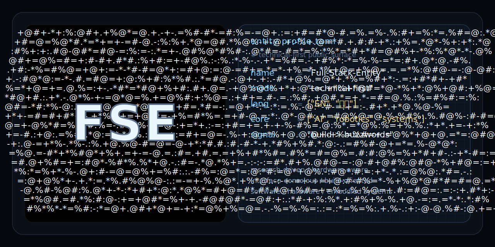

<p align="center">
  
</p>

<p align="center">
  <code>Building intelligence across software, hardware, and embodied systems.</code><br>
  <code>我把“全栈”理解为从研究、系统到底层实现与技术表达的完整闭环。</code>
</p>

```log
selected.signals.log
01 :: research-driven, build-oriented
02 :: AI / robotics / systems / hardware-aware engineering
03 :: from fundamentals -> deployment
04 :: sim -> real mindset, not single-project storytelling
05 :: technical rigor with interface taste
```

```text
focus.map
AI / embodied intelligence
systems / control / tooling
robotics / deployment / sim-to-real workflow
interface / aesthetics / technical storytelling
```

**selected.nodes**

- [RoboTwin](https://github.com/Full-Stack-Entity/RoboTwin) - simulation-side embodied intelligence workflow signal
- [Coding-Agent-Prompt-Template](https://github.com/Full-Stack-Entity/Coding-Agent-Prompt-Template) - agent tooling and workflow structure
- [nankai-ai-Datashare](https://github.com/Full-Stack-Entity/nankai-ai-Datashare) - open course-material infrastructure signal
- [Greedy-Snake-Based-on-STM32F103C8T6](https://github.com/Full-Stack-Entity/Greedy-Snake-Based-on-STM32F103C8T6) - early embedded build trace on STM32

```text
public.endpoints
/github        -> https://github.com/Full-Stack-Entity
/selected-work -> repositories above
/status        -> active / learning / building
```
